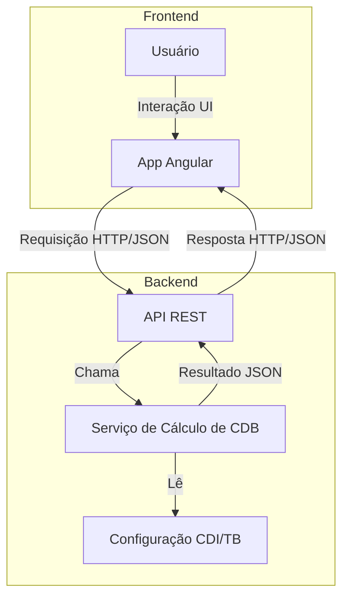

# Arquitetura da Aplicação - Simulador de CDB

Esta aplicação é composta por dois principais módulos: **Frontend** (Angular + PrimeNG) e **Backend** (ASP.NET Core WebAPI). A comunicação entre eles ocorre via HTTP(S), utilizando JSON.

---

## Diagrama de Arquitetura

## Especificação Funcional

| Item | Funcionalidade                                 | Origem/Alvo         | Observação                                         |
|------|-----------------------------------------------|---------------------|----------------------------------------------------|
| RF-01    | Simulação de CDB                              | Frontend/Backend    | Usuário informa valor, prazo, CDI e TB             |
| RF-02    | Exibição do resultado (bruto, IR, líquido)    | Frontend            | Mostra resultado formatado                         |                             |
| RF-03    | Configuração de CDI e TB                      | Frontend/Backend    | Usuário pode alterar valores                       |
| RF-04    | Persistência de CDI/TB                        | Backend             | Pode ser em memória, arquivo ou banco              |
| RF-05    | API REST para cálculo e configuração          | Backend             | Endpoints: `/api/Cdb/calculate`, `/api/Cdb/config` |
| RF-06    | Validação de dados                            | Frontend/Backend    | Checagem de valores e formatos                     |
| RF-07    | CORS habilitado                               | Backend             | Permite acesso do frontend                         |
| RF-08    | Deploy via Docker                             | Full Stack          | Containers para frontend e backend                 |
| RF-09   | Documentação Swagger                          | Backend             | Disponível em `/swagger`                           |
